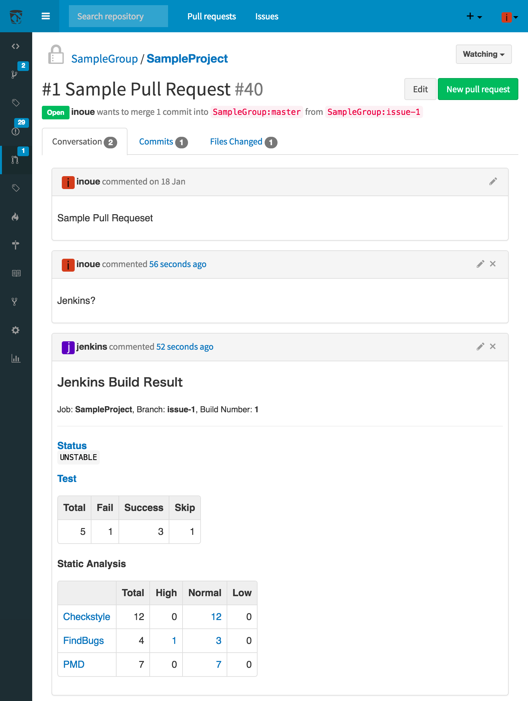
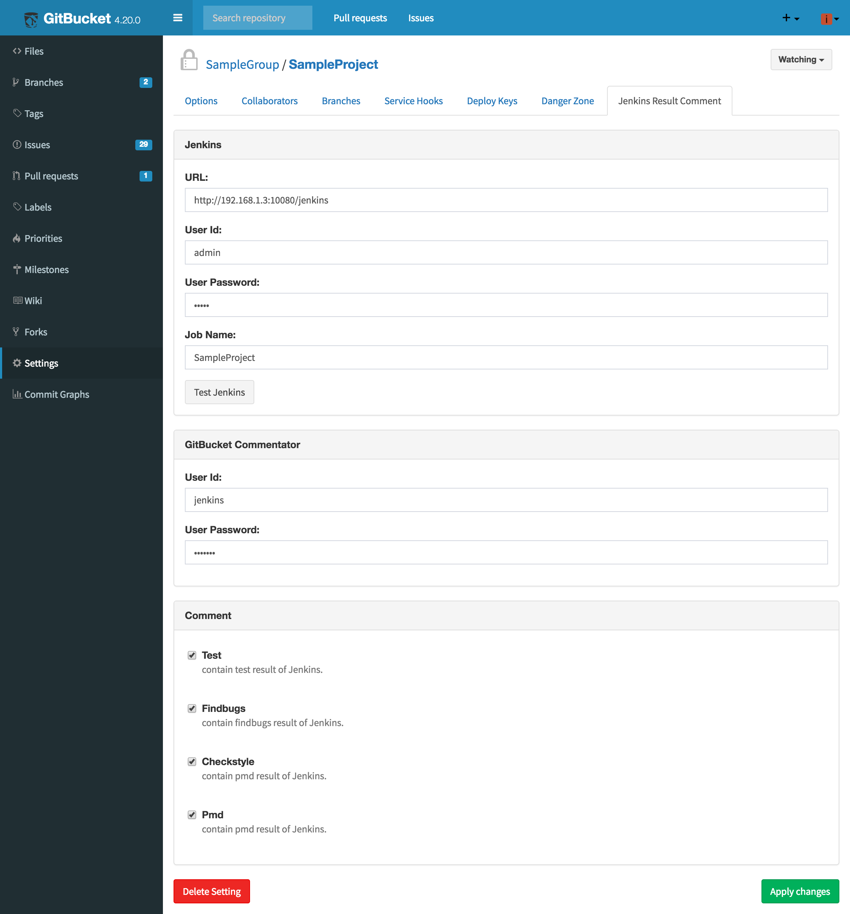

# gitbucket-jenkins-result-comment-plugin  

With this plugin,  
You can check the build result details of Jenkins in the comment field of pull request  
by commenting "Jenkins?".

 
You can do setting of the plugin by repository

## Installation

* Download jar file from [the release page](https://github.com/Takumon/gitbucket-jenkins-result-comment-plugin/releases)
* copy the jar file to `<GITBUCKET_HOME>/plugins/`  (`GITBUCKET_HOME` defaults to `~/.gitbucket`)

## Version

Plugin version|GitBucket version
:---|:---
0.1|4.20.x

## Build from source

1. Install sbt
1. `$ sbt assembly`
